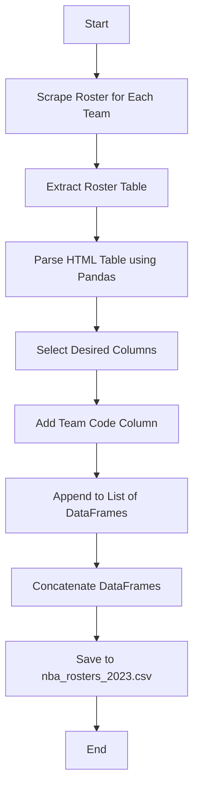
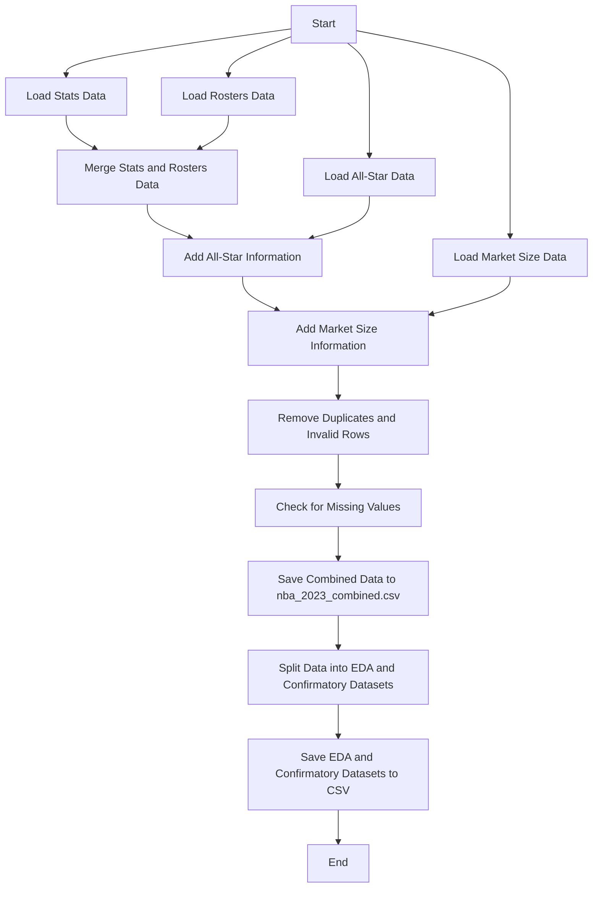

# NBA Data Pipeline DAGs

## Scraper.py Workflow

```mermaid
graph TD
    A[Start] --> B[Scrape Roster for Each Team]
    B --> C[Extract Roster Table]
    C --> D[Parse HTML Table using Pandas]
    D --> E[Select Desired Columns]
    E --> F[Add Team Code Column]
    F --> G[Append to List of DataFrames]
    G --> H[Concatenate DataFrames]
    H --> I[Save to nba_rosters_2023.csv]
    I --> J[End]
```

## combine_and_split_data.py Workflow

```mermaid
graph TD
    A[Start] --> B[Load Stats Data]
    A --> C[Load Rosters Data]
    A --> D[Load All-Star Data]
    A --> E[Load Market Size Data]
    B --> F[Merge Stats and Rosters Data]
    C --> F
    F --> G[Add All-Star Information]
    D --> G
    G --> H[Add Market Size Information]
    E --> H
    H --> I[Remove Duplicates and Invalid Rows]
    I --> J[Check for Missing Values]
    J --> K[Save Combined Data to nba_2023_combined.csv]
    K --> L[Split Data into EDA and Confirmatory Datasets]
    L --> M[Save EDA and Confirmatory Datasets to CSV]
    M --> N[End]
```
