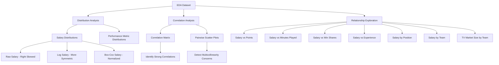
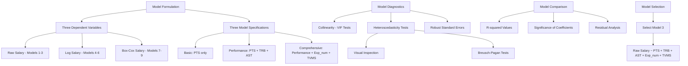
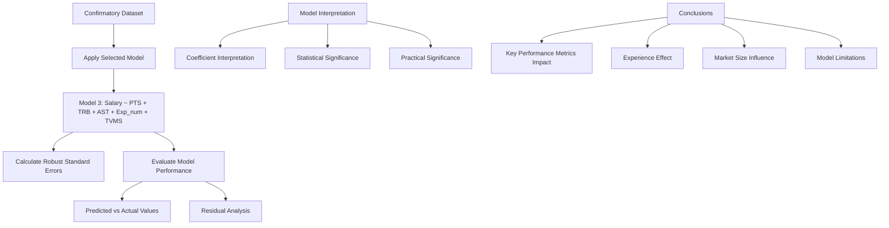

# NBA Salary Analysis Workflow

This document outlines the workflow used in our NBA salary analysis project, visualizing the process from data collection to final model interpretation.

## 2. Exploratory Data Analysis

## 3. Model Testing

## 4. Final Model

## Key Findings

- Salary distribution is heavily right-skewed, with a few high earners inflating the average
- Strong correlations exist between performance metrics (PTS, MP, WS, FG)
- Experience (years in NBA) has a significant positive relationship with salary
- TV Market Size provides additional explanatory power beyond performance metrics
- The raw salary model with performance metrics, experience, and market size (Model 3) was selected as the final model
- Heteroscedasticity was detected and addressed using robust standard errors